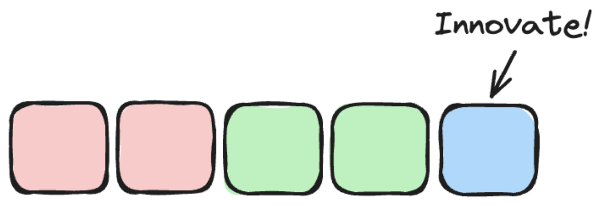

As an individual contributor have you ever had the feeling that you are living in a feature mill, where you have no time to work on anything else but delivering a constant stream of features one immediately after the other?  Perhaps you raise concerns about it at times with your leaders, but you find their suggestions (if they have any) as ultimately unworkable, or just seem frustrated with you in response, as if it’s something you should address. In this post I look to explore one way to approach this.

Maybe they even institute a practice like “10% innovation time” but in practice you don’t get any time to leverage that innovation time, because, you know, those features won’t build themselves.

What you need is to get some engineering game!
Estimation
First off you need to get some “game” you need to address your appetite problem.  You have a great plan, at the start of the week you commit to pull a couple of tasks off the backlog.  You estimate that each of those will be done in 2 days, and you smile because you have a whole day left at the end of the week to tackle something other than feature work, maybe it’s guild work, maybe it’s researching something new, perhaps it’s even taking advantage of your training budget.  The world is your oyster.

What a beautiful plan.

And then reality strikes…

Suddenly your task blows out, and your non-feature time disappears. Worse yet, you didn’t account for some meetings and other day-to-day activities, and you're still going to be working on the second task for Monday the following week, resulting in a cascading failure of time management week on week.

**You have an appetite problem!**

The fix is to reduce your appetite - this generally falls into two categories.  Either reduce the scope of the tasks you’re picking up (split them into smaller pieces), or reduce the number of tasks per week you pick up.  As a rule of thumb if things on average are taking longer than 2 days, favour splitting the tasks into smaller pieces to get the time of each task to take ideally less than 2 full days.  Remember engineers are terrible at reliably estimating longer tasks, and you need to increase the reliability in terms of time estimates to take control of your workload.

## Inflation

Once the reliability of your estimates have increased, you then need to start inflating your estimates.  Your goal is to create enough space to have 4-8 hours per week that’s not going to be required to deliver the committed work for the week and other commitments like meetings etc.

How you approach this inflation needs to take in the context of your engineering department and business. Being transparent about inflating estimates can be a great recipe for causing optics problems for your engineering leaders in the business, or in some organisations even the engineering leaders may not be experienced enough to understand this strategy. You need to use your judgement here.  Yes I’m an engineering leader encouraging engineers to not be honest, but it’s for a good cause.

If you’re looking for more acceptable language that inflating estimates (which can have a negative connotation for many non-engineers), falling back on a saying like “underpromise and overdeliver” can help.

## Align

Now you have created some space to execute on work that’s not directly related to features, it’s time to use that time.  This is where things get exciting, but also highly risky if you’re misaligned to the needs of the engineering department and the business.

Consider how you are using the time you’ve created for yourself strategically to aid your team, the engineering department, or the business.  The breadth of the impact you are seeking should ideally be proportional to your seniority.  If you’re a senior engineer looking to plot a path to staff engineer, find an activity that will have impact outside of just your team.   Guild meetings, or unaddressed mitigations on post mortems are often good starting points if you’re not inspired.

## Socialise

There can be a temptation to work alone and then surprise everyone with the “big reveal” of what you’ve been working on.  Surprise parties can be fun, but surprising engineering leaders or the business is generally less fun than you might think, particularly if it catches your leaders off guard with questions from the wider business like “did you know they were working on that?” which might mean you just blew your one chance to work on something other than feature work without future scrutiny.

You may be in an environment where if you explicitly mention what you’re working on outside of feature work it will be shut down. Sharing these experiences in public forums often will see you receiving a bunch of helpful feedback on the theme of “go find a new job” - which might be applicable, but you can also learn a lot from navigating dysfunctional organisations, and those are great skills to have in your toolbelt as a future leader (speaking from experience…) so it’s not a reason not to try and find a way to navigate the situation, if your up for the challenge.

A way I have found to navigate this can be to socialise the problem rather than the solution, your fellow engineers and leaders love talking about problems and proffering their own potential solutions, and through this process you will get validation of the problems importance, ideas of what acceptable solutions may be and so on, without playing your hand that your actively working on a solution.

Consider your answers to the two questions of “who would advocate for this being a worthwhile problem for me to solve” and “who would be surprised to find I had solved this” - be careful when the first answer is no one and the second has too many people.

## Start small

You need to build credibility by regularly achieving outcomes favourable to the business.  Ideally start small and solve unglamorous but valuable problems outside feature work, then tackle more open-ended and challenging problems over time.  In doing so you can move to being more transparent about how you are allocating time in your week, cementing it as part of the work you do each week beyond features.  Being able to work entirely the open is always easier in due course, and allows you to be an agent of change for other engineers who may look up to you within the organisation.

## Some words of warning

This strategy is generally more suited to high intermediate or ideally early seniors and above.  If you are still learning your craft, it can be tempting to employ a strategy like this, but in practice the work in front of you is the most valuable thing for you and the business, and you generally lack the experience to reliably estimate any task you have not tackled before (sorry it might sound mean, but experience tells me it’s generally true).

Second, be wary of picking up tasks that significantly exceed your operational experience without finding a technical sponsor/mentor internally to support you.  Some problems can seem simple initially but can have significant knock-on effects on resiliency or operational characteristics on a distributed system - expanding a home-grown feature flag system to be dynamic is a great example of what on the outset seems a simple problem, but unless carefully thought through can have significant operational impacts for the on-call team in making deployment and rollback predictable. Picking up these tasks (without the relevant experience) can end up feeling like you are battling an unwinnable war with your more senior peers.

## Wrap up

Fundamentally the idea of having “game” as a software engineer is the ability to navigate a duality of an outwards and inwards view of your capacity, allowing you to employ some of your capacity strategically for the business and your career, with the understanding that it's your responsibility to use that time wisely, giving you the following outcomes:

- Working on tasks unrelated to feature work.
- Bringing you additional work satisfaction and opportunities to learn new things.
- Allow you to have more impact than you might otherwise have by just completing feature work, ultimately benefiting the business and demonstrating your strengths.
- Develop your strategic muscles and broader department and business critical thinking, which are important for future career growth.
- Giving you a sense of agency and control over your life as an engineer, and ultimately addressing some of those key elements of drive (autonomy, mastery and purpose).